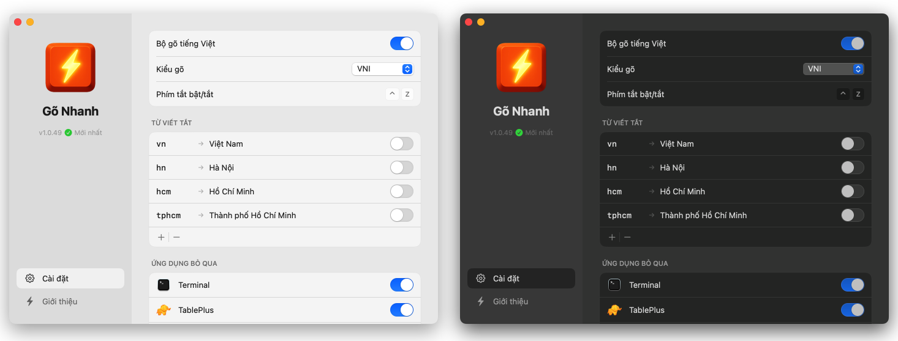

<h1 align="center">
  <br>
  Gõ Nhanh
</h1>

<p align="center">
  
  
</p>
<p align="center">
  
  
  
  
  
</p>

<p align="center">
  <strong>Bộ gõ tiếng Việt miễn phí, nhanh, ổn định cho macOS, Linux, Windows.</strong><br>
  Cài là dùng. Không quảng cáo. Không thu thập dữ liệu.
</p>

<p align="center">
  
</p>

---

## 📥 Tải về & Cài đặt

| Nền tảng | Trạng thái | Tải xuống | Hướng dẫn |
|:--------:|:----------:|:---------:|:----------|
| **macOS** | ✅ Sẵn sàng | [📥 Tải GoNhanh.dmg](https://github.com/nguyennhuanhle/gonhanh.org/releases/latest/download/GoNhanh.dmg) | [Xem hướng dẫn](docs/install-macos.md) |
| **Linux** | ✅ Sẵn sàng | [📥 Tải gonhanh-linux.tar.gz](https://github.com/nguyennhuanhle/gonhanh.org/releases/latest/download/gonhanh-linux.tar.gz) | [Xem hướng dẫn](docs/install-linux.md) |
| **Windows** | ✅ Sẵn sàng | [📥 Tải GoNhanh-win-x64.msi](https://github.com/nguyennhuanhle/gonhanh.org/releases/latest/download/GoNhanh-win-x64.msi) | [Xem hướng dẫn](docs/install-windows.md) |

## ✨ Tính năng

### 🔥 Highlight

- 🔍 **Fix lỗi Chrome/Spotlight/Claude Code/JetBrains** - Tự động sửa dính chữ trong address bar, thanh tìm kiếm
- 🔤 **Auto-restore tiếng Anh** — Gõ `text` `expect` `user` `push` `sort` → tự khôi phục khi nhấn space. [Xem chi tiết ↓](#-auto-restore-tiếng-anh)
- ⎋ **Gõ ESC tự khôi phục** — Gõ `user` → `úẻ` → nhấn **ESC** → `user`. Không cần tắt bộ gõ khi gõ tiếng Anh!
- 🧠 **Chuyển chế độ thông minh** — Tự nhớ ON/OFF cho từng app. Code trên VS Code (tắt) → Chat trên Slack (bật) → tự chuyển
- 🏷️ **Hỗ trợ raw mode**: gõ `\`, `@`, `#`, `:`, `/` ở đầu để tắt chuyển đổi tiếng Việt (ví dụ: `\mix` → `mix`)
- ⚡ **Siêu nhanh** — <1ms latency · ~5MB RAM. Hỗ trợ đa nền tảng trên cùng một engine

### 📋 Đầy đủ

- ⌨️ **Telex & VNI** — Chọn kiểu gõ quen thuộc
- 🎯 **Đặt dấu chuẩn** — Tự động theo [quy tắc mới](https://vi.wikipedia.org/wiki/Quy_t%E1%BA%AFc_%C4%91%E1%BA%B7t_d%E1%BA%A5u_thanh_c%E1%BB%A7a_ch%E1%BB%AF_Qu%E1%BB%91c_ng%E1%BB%AF): `hoà`, `khoẻ`, `thuỷ`
- ✂️ **Gõ tắt** — `vn` → `Việt Nam`, `ko` → `không`
- 🔌 **Mọi app** — VS Code, Zed, Chrome, Notion, Terminal, Ghostty...
- 🌗 **Dark/Light** — Theo hệ thống
- 💻 **Đa nền tảng** — macOS, Linux, Windows

### 🛡️ Cam kết "Ba Không"

- 🚫 **Không thu phí** — Miễn phí mãi mãi, không bản Pro
- 🚫 **Không quảng cáo** — Không popup, không làm phiền
- 🚫 **Không theo dõi** — Offline 100%, mã nguồn mở

## 🆚 So sánh với bộ gõ khác

| Vấn đề thường gặp | Bộ gõ khác | Gõ Nhanh |
|:------------------|:----------:|:--------:|
| Gõ tiếng Anh xen kẽ | ⚠️ Phải tắt/bật bộ gõ | ✅ Nhấn `ESC` khôi phục |
| Dính chữ trên Chrome/Edge | ⚠️ Phải tắt autocomplete | ✅ Tự động fix |
| Lặp chữ trên Google Docs | ⚠️ Phải bật "Sửa lỗi" | ✅ Tự động fix |
| Nhảy chữ trên Terminal | ❌ Không hỗ trợ tốt | ✅ Hoạt động tốt |
| Gạch chân khó chịu (macOS) | ❌ Luôn hiển thị | ✅ Không gạch chân |
| Cấu hình phức tạp | ⚠️ 10+ tùy chọn | ✅ Cài là dùng |
| Gõ trong ô mật khẩu | ❌ Bị chặn | ✅ Hoạt động bình thường |

> 💡 **Khi nào dùng bộ gõ khác?** Nếu bạn cần chuyển đổi bảng mã cũ (VNI, TCVN3...), hãy dùng UniKey/EVKey/OpenKey.

Chi tiết: [Các lỗi thường gặp](docs/common-issues.md)

---

## 🔤 Auto-restore tiếng Anh

Khi gõ tiếng Anh bằng Telex, một số chữ cái bị nhận nhầm thành modifier tiếng Việt:
- `s` → sắc, `f` → huyền, `r` → hỏi, `x` → ngã, `j` → nặng
- `w` → dấu móc (ư, ơ)

**Gõ Nhanh tự động khôi phục** khi nhấn **Space** nếu phát hiện pattern tiếng Anh.

### ✅ Các pattern được nhận diện

| Pattern | Ví dụ | Giải thích |
|:--------|:------|:-----------|
| **Modifier + phụ âm** | `text` `next` `test` `expect` `express` | x/s theo sau bởi phụ âm (t, p, c...) |
| **EI + modifier** | `their` `weird` | Cặp nguyên âm "ei" + r/s/f... |
| **P + AI + modifier** | `pair` | P đầu (hiếm trong tiếng Việt) + ai |
| **Nguyên âm + modifier + nguyên âm** | `use` `user` | Không có phụ âm đầu |
| **W đầu + phụ âm** | `window` `water` `write` `what` | W không phải phụ âm đầu tiếng Việt |
| **W + nguyên + W** | `wow` | Pattern "wow" đặc trưng tiếng Anh |
| **F đầu** | `file` `fix` `function` `firebase` | F không tồn tại trong tiếng Việt |

### 📝 Ví dụ thực tế

```
Gõ: "text "     → Kết quả: "text "     ✅ (x+t = pattern Anh)
Gõ: "expect "   → Kết quả: "expect "   ✅ (x+p = pattern Anh)
Gõ: "window "   → Kết quả: "window "   ✅ (W đầu + phụ âm)
Gõ: "firebase " → Kết quả: "firebase " ✅ (F đầu)
Gõ: "their "    → Kết quả: "their "    ✅ (ei + r)
Gõ: "pair "     → Kết quả: "pair "     ✅ (P + ai + r)
Gõ: "wow "      → Kết quả: "wow "      ✅ (W + o + W)

Gõ: "mái "      → Kết quả: "mái "      ✅ (giữ tiếng Việt)
Gõ: "cái "      → Kết quả: "cái "      ✅ (giữ tiếng Việt)
Gõ: "được "     → Kết quả: "được "     ✅ (giữ tiếng Việt)
```

### ⚠️ Giới hạn

Một số từ tiếng Anh tạo ra cấu trúc **hợp lệ tiếng Việt** nên không thể tự nhận diện:

| Từ Anh | Kết quả Telex | Lý do |
|:-------|:--------------|:------|
| `mix` | `mĩ` | M + ĩ hợp lệ |
| `box` | `bõ` | B + õ hợp lệ |
| `six` | `sĩ` | S + ĩ hợp lệ |

**Giải pháp:**
- Dùng **raw mode**: gõ `\mix` → `mix`
- Nhấn **ESC** sau khi gõ để khôi phục
- Tắt bộ gõ tạm thời (⌘+Space hoặc click menu bar)

## ❤️‍🔥 Động lực

Tôi (**Kha Phan**) bắt đầu dự án này vì các bộ gõ hiện tại thường xuyên gặp lỗi khi tôi làm việc với **Claude Code**.

Từ nhu cầu giải quyết vấn đề cá nhân, Gõ Nhanh được phát triển thành một sản phẩm hoàn thiện dành tặng cộng đồng. Đây cũng là sự tiếp nối và kế thừa từ **UniKey**, **OpenKey** và **EVKey**.

Hy vọng Gõ Nhanh góp phần truyền cảm hứng cho cộng đồng mã nguồn mở tại Việt Nam.

---

## 🔧 Dành cho Developer

### Cách hoạt động

Engine dựa trên **ngữ âm học tiếng Việt** thay vì bảng tra cứu:

```
Âm tiết = [Phụ âm đầu] + [Âm đệm] + Nguyên âm chính + [Âm cuối] + Thanh điệu
          (b,c,d,g...)   (o,u)      (a,ă,â,e,ê...)    (c,m,n,p,t)  (sắc,huyền...)
```

Chi tiết: [docs/core-engine-algorithm.md](docs/core-engine-algorithm.md) | [docs/vietnamese-language-system.md](docs/vietnamese-language-system.md)

### Build & Test

```bash
# Setup (chạy 1 lần)
./scripts/setup.sh

# Development
make test      # Chạy tests
make format    # Format + lint
make build     # Build full app
make install   # Copy vào /Applications
```

### Nguyên tắc thiết kế

| Nguyên tắc | Chi tiết |
|------------|----------|
| **Anti-over-engineering** | Không abstraction layer thừa. Inline code khi chỉ dùng 1 chỗ |
| **Performance-first** | Target: <1ms latency, <10MB RAM. Không allocation trong hot path |
| **Zero dependency** | Rust core chỉ dùng `std`. Không crates ngoài |
| **Test-driven** | 470+ tests với coverage 100%. Bao gồm edge cases tiếng Việt và auto-restore tiếng Anh |
| **Validation-first** | Reject invalid input sớm. Validate trước khi transform |
| **Platform-agnostic core** | Core = pure Rust, no OS-specific code. UI layer riêng cho mỗi platform |

### Tài liệu kỹ thuật

| Tài liệu | Mô tả |
|----------|-------|
| [Kiến trúc hệ thống](docs/system-architecture.md) | FFI, luồng dữ liệu, app compatibility |
| [Validation Algorithm](docs/validation-algorithm.md) | 5 quy tắc kiểm tra âm tiết |
| [Hệ thống chữ viết tiếng Việt & Phương pháp gõ](docs/vietnamese-language-system.md) | Cơ sở lý thuyết |
| [Hướng dẫn phát triển](docs/development.md) | Build, test, contribute |

---

## ⭐ Star History

[](https://www.star-history.com/#nguyennhuanhle/gonhanh.org&type=Timeline&legend=bottom-right)

---

## 📄 License

Copyright © 2025 Gõ Nhanh Contributors. [BSD-3-Clause](LICENSE).
